Before you start!
=================

The tutorial below relies on you having several R packages installed
which are listed below. These can be installed using the
`install.packages` command.

-   [lattice](https://cran.r-project.org/web/packages/lattice/index.html)
-   [spocc](https://cran.r-project.org/web/packages/spocc/index.html)
-   [blighty](https://cran.r-project.org/web/packages/blighty/index.html)
-   [raster](https://cran.r-project.org/web/packages/raster/index.html)
-   [dplyr](https://cran.r-project.org/web/packages/dplyr/index.html)
-   [sqldf](https://cran.r-project.org/web/packages/sqldf/index.html)

# 1. Loading Data

R packages exist to load in pretty much any form of data you can think
of. Some key examples include:

-   [readr](https://cran.r-project.org/web/packages/readr/README.html)
    tends to work faster and have more functionality for flat files
    (.csv, .txt) than base R (useful for big files)
-   [readxl](https://blog.rstudio.org/2015/04/15/readxl-0-1-0/) for
    Excel spreadsheets
-   [RODBC](https://cran.r-project.org/web/packages/RODBC/RODBC.pdf) for
    many types of database including Access
-   [RPostgreSQL](https://www.r-bloggers.com/getting-started-with-postgresql-in-r/)
    for PostgreSQL databases
-   [googlesheets](https://cran.r-project.org/web/packages/googlesheets/googlesheets.pdf)
    to interface with Google sheets
-   [raster](https://cran.r-project.org/web/packages/raster/raster.pdf)
    and [rgdal](https://cran.r-project.org/web/packages/rgdal/rgdal.pdf)
    for spatial data
-   [ncdf4](https://cran.r-project.org/web/packages/ncdf4/ncdf4.pdf) for
    NetCDF files
-   [RCurl](https://cran.r-project.org/web/packages/RCurl/RCurl.pdf)
    contains functions to fetch data from webpages (along with lots more
    functionality for interfacing with webpages)

## 1.1 Reading in .csv files

Most of the data we will use in this tutorial are stored in .csv files.
Below we use the `read.csv` function to load these files and the
`summary` function to inspect their contents.

*Hint* - The .csv files you require are in BES-QSIG/Data-integration-R
folder on Github. To download the .csv files along with this document,
click 'Clone or download' and select 'Download ZIP' to download a ZIP
file with all the course contents. Unzip this and save the files to a
location on your computer.

    #set working directory
    setwd("Put the path to the csv files you downloaded from Github here e.g. C:/My name/Documents/")

    #read in csv files using read.csv
    cs_data <- read.csv("LANDSCAPE_AREA_FEATURE_HAB_1978.csv")
    cs_locs <- read.csv("CS_locations_false.csv")
    ag_data <- read.csv("EnglandWales_1979_2k.csv")

    #Look at summaries of the three csv files you have loaded
    summary(cs_data)
    summary(cs_locs)
    summary(ag_data)

# 2. Fetching data from online sources

Plenty of sources of data exist online, and a lot of these have related
R packages to facilitate their downloading. The
[ROpenSci](https://ropensci.org/) project have developed a suite of
packages to do just this. Other useful R packages for downloading online
data sources include
[MODIS](https://cran.r-project.org/web/packages/MODIS/index.html) for
downloading the MODIS remote sensing data and
[bioclim](https://rforge.net/doc/packages/climates/bioclim.html) for
recreating the 19 bioclimatic variables used by WorldClim.

## 2.1 Downloading species' occurrence data using [`spocc`](https://ropensci.org/tutorials/spocc_tutorial.html)

We are going to use the `spocc` package to download records for
yellowhammer (*Emberiza citrinella*) from GBIF.

First, we will need a bounding box to limit the records to those within
our study area. I have created one for the entire Great Britain using a
[tool to create a Well Known Text (WKT)
polygon](http://arthur-e.github.io/Wicket/sandbox-gmaps3.html).

    bb <- "POLYGON((-9.457034468650818 59.70101353199732,3.902340531349182 59.70101353199732,3.902340531349182 49.13859653703879,-9.457034468650818 49.13859653703879,-9.457034468650818 59.70101353199732))" 

We can then load the `spocc` package and use the `occ` function to
download records for a species of interest, here we will download
occurrence records for the yellowhammer from the GBIF database.

    library(spocc)

    ## Warning: package 'spocc' was built under R version 3.3.3

    yellowhammer <- occ(query = 'Emberiza citrinella', from = 'gbif', geometry = bb)

The `spocc` package also provides a function to convert the retrieved
data to a dataframe

    yellowhammer_df <- occ2df(yellowhammer)

    head(yellowhammer_df)

    ## # A tibble: 6 × 6
    ##                  name longitude latitude  prov       date        key
    ##                 <chr>     <dbl>    <dbl> <chr>     <date>      <int>
    ## 1 Emberiza citrinella  1.239290 52.29265  gbif 2016-01-19 1337491175
    ## 2 Emberiza citrinella -1.726322 55.61482  gbif 2016-01-30 1453107192
    ## 3 Emberiza citrinella -2.679050 53.44983  gbif 2016-01-08 1326639488
    ## 4 Emberiza citrinella -2.679050 53.44983  gbif 2016-01-07 1326711021
    ## 5 Emberiza citrinella  1.239290 52.29265  gbif 2016-02-13 1337491570
    ## 6 Emberiza citrinella  1.239290 52.29265  gbif 2016-02-12 1337480757

### 

# 3. Visualising and exploring data:

Here we will look in more detail at the data from the .csv files you
loaded in part 1. There are three tables:

-   `ag_data` gives a range of Agricultural Census variables for year
    1979 at 2km gridded resolution. A range of additional variables
    and/or years can be downloaded from
    [agcensus](https://access.edina.ac.uk/agcensus/)

-   `cs_data` gives the Countryside Survey habitat areas for 256 1km
    squares surveyed in 1978. Additional datasets and/or years can be
    downloaded from the
    [EIDC](https://catalogue.ceh.ac.uk/eidc/documents#term=Countryside+Survey&page=1)

-   `cs_locs` gives (incorrect) locations for the 256 CS squares. The
    locations are confidential which is why false locations are given
    for the purposes of this tutorial. True locations are available on
    request at 10km resolution via the
    [EIDC](https://catalogue.ceh.ac.uk/eidc/documents#term=Countryside+Survey&page=1)

Firstly, we will look at the `cs_data` table and do some exploratory
analysis of this data, before moving on to look at integrating this
information with the `cs_locs` and `ag_data` tables.

We can start by removing some columns that aren't useful from the CS
data (year, ID code, land class and environmental zone which we won't be
using in the analysis).

    cs_data <- subset(cs_data, select = -c(YEAR,ID,LAND_CLASS90,EZ_DESC_07))

The CS data holds data on habitat area mapped within each 1km square. We
can make a simple boxplot to compare the average habitat area per 1km
Countryside Survey sample square for each habitat.

    boxplot(cs_data$AREA ~ cs_data$BROAD_HABITAT)

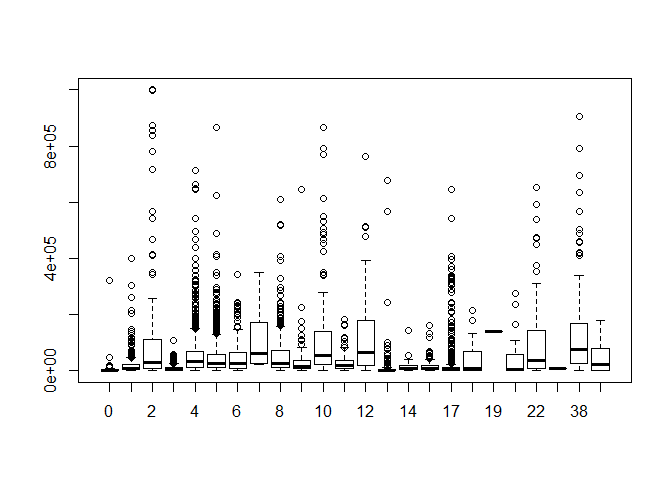

This is very messy and not very informative! Let's focus on a few
habitats of interest and group the priority habitats (e.g. saltmarsh,
blanket bog) together in one category. Arable, improved grassland and
woodland, along with the total priority habitat area, might be expected
to be related to agricultural intensity so we'll focus on these habitats
to start with.

Firstly, we'll create new columns for the area of each of our habitats
of interest

    cs_data$arable_area <- 0 #create empty column to start
    cs_data$arable_area[cs_data$BROAD_HABITAT == 4] <- cs_data$AREA[cs_data$BROAD_HABITAT == 4] #arable has BROAD_HABITAT code 4
    cs_data$impgrass_area <- 0 #create empty column to start
    cs_data$impgrass_area[cs_data$BROAD_HABITAT == 5] <- cs_data$AREA[cs_data$BROAD_HABITAT == 5] #improved grassland has BROAD_HABITAT code 5 
    cs_data$woodland_area <- 0 #create empty column to start
    cs_data$woodland_area[cs_data$BROAD_HABITAT %in% c(1,2)] <- cs_data$AREA[cs_data$BROAD_HABITAT %in% c(1,2)] #this considers both broadleaf (code = 1) and coniferous (2) woodland

Now we will create a new column of priority habitat area

    cs_data$priority <- 0
    cs_data$priority[cs_data$BROAD_HABITAT %in% 24:45] <- 1
    cs_data$priority_area <- cs_data$AREA*cs_data$priority

Finally, we can aggregate the data by CS 1km square (SQUARE field) to
calculate the sum of priority habitat for each square

    cs_areas <- aggregate(cbind(arable_area,impgrass_area,woodland_area,priority_area) ~ SQUARE + COUNTRY + COUNTY, data = cs_data,FUN = sum)

We can now look at some exploratory plots of the aggregated data. For
example, we could look at how the average area of arable habitat in each
CS square varies between England, Scotland and Wales.

    boxplot(cs_areas$arable_area ~ cs_areas$COUNTRY)

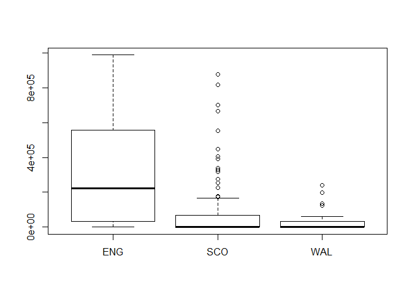

It is fairly clear that the area of arable land in a 1km CS square tends
to be higher in England than in Scotland and Wales. You can swap
`arable_area` for `priority_area` to see if a similar pattern holds for
the area of priority habitats.

We can also look at the distributions of each habitat area by plotting a
histogram.

    hist(cs_areas$arable_area)

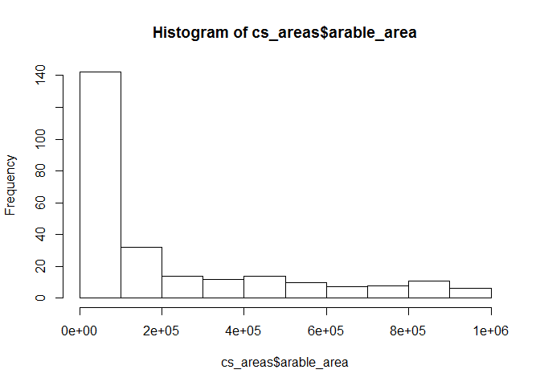

Here we can see that the majority of the 256 CS squares have relatively
little arable area, with a long tail of squares with high areas of
arable land. Does the same pattern occur in the distributions of the
other habitats?

## 3.1 Mapping the Countryside Survey data

To enable us to map the Countryside Survey data we need to join it to
location data which sits in a separate file called `CS_locs`.

The next step is to join the habitat data to this location information.
Note these locations are incorrect due to confidentiality over
Countryside Survey locations.

    #add (false) locations where SQUARE column matches between data sets
    cs_areas$EASTING <- cs_locs$Easting[match( cs_areas$SQUARE,cs_locs$SQUARE)]
    cs_areas$NORTHING <- cs_locs$Northing[match( cs_areas$SQUARE,cs_locs$SQUARE)]

We will use the `blighty` package to map the data.

    library(blighty)
    blighty()

    ## 
    ## Plotting  set.British.Isles  be patient ...
    ## Data loaded ...

    ## Correct aspect ratio calculated ...
    ## Map complete ...

    points(cs_areas$EASTING/1000, cs_areas$NORTHING/1000, cex = 1, pch = 20, col = "red")

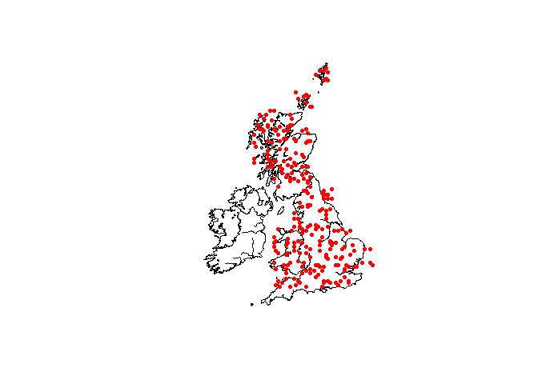

Note the nonsense locations so some might be in the sea!

We can colour the points by the area of one of the habitats (in this
case arable):

    blighty()

    ## 
    ## Plotting  set.British.Isles  be patient ...
    ## Data loaded ...

    ## Correct aspect ratio calculated ...
    ## Map complete ...

    points(cs_areas$EASTING/1000, cs_areas$NORTHING/1000, pch = 20, col = ceiling(cs_areas$arable_area/100000)+1)
    legend(550,1200, c("0-0.09", "0.1-0.19","0.2-0.29","0.3-0.39","0.4-0.49","0.5-0.59","0.6-0.69","0.7-0.79","0.8-0.89","0.9-0.99", "1"), col = 1:11, pch = 20, cex = 0.6, title = "Arable land (km2)")

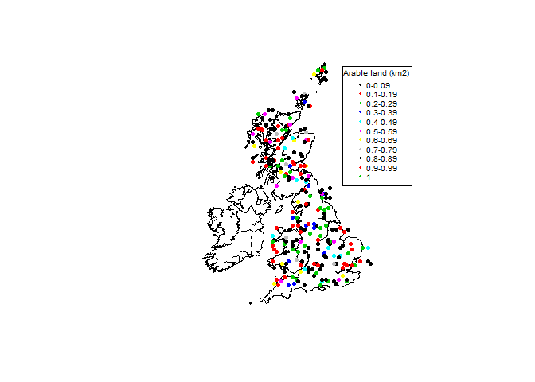

Not much spatial pattern due to the false locations!

## 3.2 Exploring and mapping the Agcensus data

The Agcensus data in `ag_data` has a selection of data available from
the [agcensus](https://access.edina.ac.uk/agcensus/) webpage (total
number of holdings, total area of holdings, total area of crops and
fallow land, area of rough grass, amount of woodland on holding - all
areas in hectares). We can use the `lattice` package to easily look at
relationships between different data.

    library(lattice)

    pairs(ag_data[1:1000,3:7])

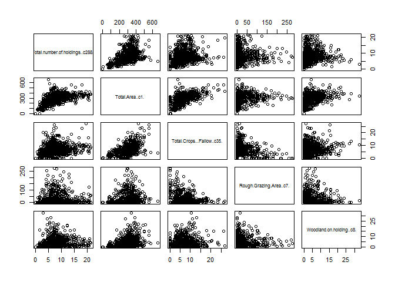

Here only data from the first 1000 rows are plotted to speed up drawing
of the plot. Which variables are related to each other? Does this make
sense?

We can then use the `blighty` package again to map the data.

    blighty()

    ## 
    ## Plotting  set.British.Isles  be patient ...
    ## Data loaded ...

    ## Correct aspect ratio calculated ...
    ## Map complete ...

    points(ag_data$x/1000, ag_data$y/1000)

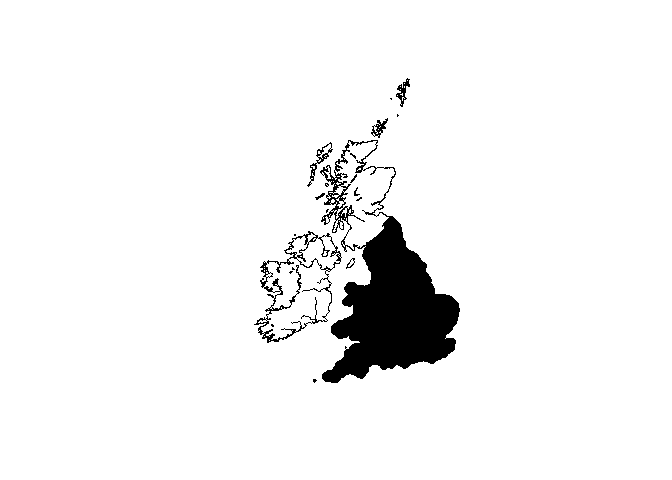

Yikes! The map is full of points! A better solution is to convert to
raster data. This makes sense as the data are gridded and have a set
resolution (2 km). We can convert the data using the `raster` package.

Also note we only have Agcensus data for England and Wales in this
example.

    library(raster)

    #look at total area of holdings
    ag_raster_df <- ag_data[,c(1,2,4)]

    coordinates(ag_raster_df) <- ~x+y
    gridded(ag_raster_df) <- TRUE
    ag_raster <- raster(ag_raster_df)
    plot(ag_raster)

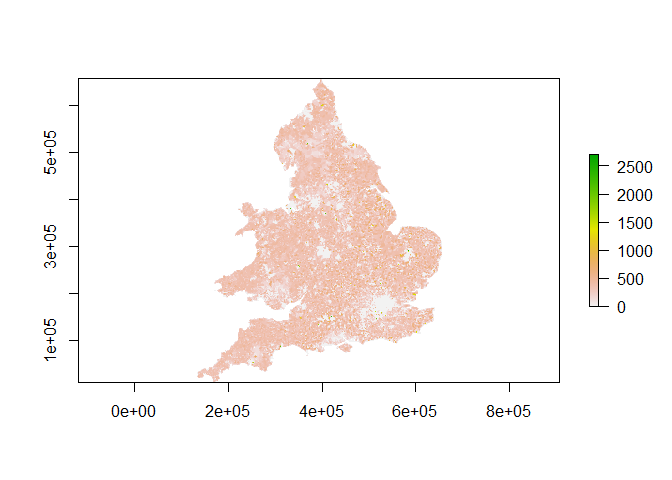

    #get information about raster
    ag_raster

    ## class       : RasterLayer 
    ## dimensions  : 323, 261, 84303  (nrow, ncol, ncell)
    ## resolution  : 2000, 2000  (x, y)
    ## extent      : 133000, 655000, 11000, 657000  (xmin, xmax, ymin, ymax)
    ## coord. ref. : NA 
    ## data source : in memory
    ## names       : Total.Area..c1. 
    ## values      : 0, 2702.9  (min, max)

    #note resolution - 2km by 2km (units are m)

Obtaining the resolution of the Agcensus data is straightforward,
however what is the resolution of the Countryside Survey data? The
sample is at 1km resolution but the accuracy of location is at 10km!
Because we don't have the 1km locations we will treat the CS data as if
it is at 10km resolution in the next section, but it is important to
consider what this means for interpretation later on.

# 4. Aggregating raster data

If we want to be able to compare the total area of agricultural holdings
to the 10km CS squares, we need to aggregate the agricultural census
data to 10km x 10km. We need to aggregate the original 2km x 2km raster
by a factor of 5.

    ag_10km <- aggregate(ag_raster, fact = 5)
    plot(ag_10km)

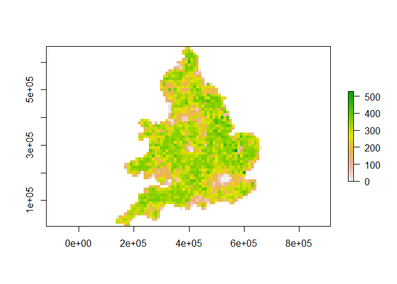

The `aggregate` function gives us the mean value for the aggregated
raster by default. Sometimes we may want to apply a different function
to aggregate a raster. For example, if we had elevation data, we may be
more interested in the variation of the terrain, rather than a mean
elevation. This can be done by using the argument `fun = var`.

# 5. Matching spatial data sources

Spatial data come associated with coordinate reference systems. This
allows data sets stored or displayed with different CRS's to be compared
to each other. The CS and agricultural census data are stored as British
National Grid, and the species data are WGS84. We can get the string
required by R for any CRS from <http://spatialreference.org/>.

    wgs84_proj <- CRS("+proj=longlat +ellps=WGS84 +datum=WGS84 +no_defs")
    bng_proj <- CRS("+proj=tmerc +lat_0=49 +lon_0=-2 +k=0.9996012717 +x_0=400000 +y_0=-100000 +ellps=airy +datum=OSGB36 +units=m +no_defs")

Now we shall convert the CS areas to points, so that we can spatially
match them to the agricultural census data to extract the mean area of
holdings for each CS square.

    cs_coords <- cs_areas[,c("EASTING", "NORTHING")]
    cs_points <- SpatialPointsDataFrame(coords = cs_coords, data = cs_areas, proj4string = bng_proj)

The agricultural census raster currently does not have a CRS associated
with it. We can set this using the `proj4string` function.

    proj4string(ag_10km) <- bng_proj

We can now plot the locations of the CS squares together with the
agricultural census data.

    plot(ag_10km)
    plot(cs_points, add=TRUE, pch = 16)

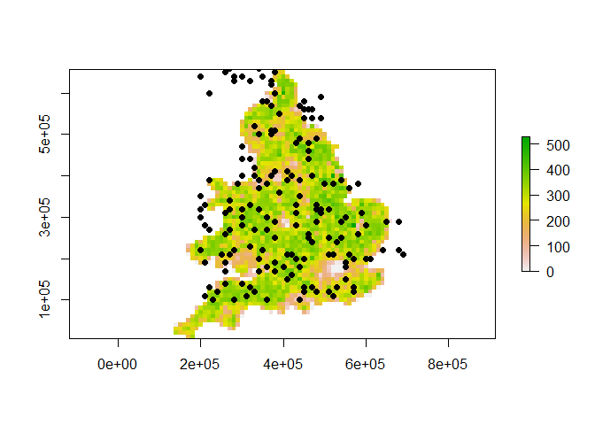

We can also extract information from the underlying agricultural census
raster to each of the CS points using the `extract` function.

    cs_points$ag_holding <- extract(ag_10km, cs_points)

# 6. Joining datasets

Now that we have the agricultural holdings data for each CS location, we
can attach that information to the CS data to create a complete dataset.
When joining datasets, it's important to think about the kind of
relationship between them. There are three such relationships:

-   One-to-one: each element of dataset A is related to exactly one
    element of dataset B
-   One-to-many: each element of dataset A is related to &gt; 1 element
    of dataset B
-   Many-to-many: &gt;1 element of dataset A is related to &gt; 1
    element of dataset B

In our case, we want to join `cs_points` with `cs_data`. `cs_points` has
one row per CS square, whereas `cs_data` has one row for each CS square
and broad habitat combination. This means that we have a one-to-many
relationship.

We use the function `merge` to join these two datasets. First we will
select only the columns we want to join, as well as the ID column

    cs_points@data <- subset(cs_points@data, select=c("SQUARE", "ag_holding"))
    cs_data <- merge(cs_data, cs_points, by="SQUARE")

Sometimes we may be interested in where there is not a match between two
datasets. For example if we had a set of grid cell IDs and a set of
species occurrences referenced by grid cell. We might want to keep all
grid cells regardless of whether the species has been recorded or not.
This can be done using the `all.x=TRUE`, `all.y=TRUE` or `all=TRUE`
arguments. These are equivalent to what is known as a left join, right
join or full outer join respectively. The join we did above is known as
an inner join.

# 7. Summarising data

We may also want to summarise data in a non-spatial way. For example
summarising from daily to monthly, or summarising by a categorical
variable such as habitat. In the below example, we calculate the mean
and total agricultural holding per broad habitat type. The
[tidyr](https://cran.r-project.org/web/packages/tidyr/index.html) and
[dplyr](https://cran.rstudio.com/web/packages/dplyr/vignettes/introduction.html)
packages offer many functions for manipulating and summarising data in a
readable and user friendly way.

    library(dplyr)

    ## Warning: package 'dplyr' was built under R version 3.3.2

    ag_summary <- group_by(cs_data, BROAD_HABITAT_NAME) %>%
      summarise(mean_ag_holding = mean(ag_holding, na.rm=TRUE),
                total_ag_holding = sum(ag_holding, na.rm=TRUE))
    ag_summary

    ## # A tibble: 24 × 3
    ##                     BROAD_HABITAT_NAME mean_ag_holding total_ag_holding
    ##                                 <fctr>           <dbl>            <dbl>
    ## 1                     (ph) Blanket Bog        253.1675        12405.205
    ## 2               (ph) Coastal Saltmarsh        236.8140          947.256
    ## 3  (ph) Purple Moor Grass Rush Pasture        363.5080          363.508
    ## 4                       Acid Grassland        297.2661        41319.993
    ## 5              Arable and Horticulture        258.9813        95564.114
    ## 6                                  Bog        296.2053        15698.879
    ## 7         Boundary and Linear Features        269.3106        50091.767
    ## 8                              Bracken        321.8582        15449.195
    ## 9   Broadleaved Mixed and Yew Woodland        288.7763        62953.228
    ## 10                Calcareous Grassland        302.7874         2119.512
    ## # ... with 14 more rows

# 8. Relationships between data

To look at relationships between habitat area and Agcensus data
(specifically the total area of holdings) using the merged dataset
created in section 6. However, we want to make two changes:

1.  We want to add in the other Agcensus data (area of crops, grass and
    woodlands as well as total number of holdings)

2.  We want to summarise the data by 1km square

We could repeat the process of creating an aggregated raster layer for
each Agcensus data type and then extracting by CS square, but instead we
will use a different process to demonstrate some alternative techniques.

Firstly, we add two new columns to the `ag_data` which give the 10km
grid references. We can then use `aggregate` to calculate the mean
agricultural data per 10km square (this is a non-spatial alternative to
the raster aggregration process in section 4).

    ag_data$x_10km <- floor(ag_data$x/ 10000)*10000
    ag_data$y_10km <- floor(ag_data$y/ 10000)*10000

    ag_10km <- aggregate(. ~ x_10km + y_10km, data = ag_data, FUN = mean)

Secondly we will use another package called `sqldf` to use the SQL
language to join the datasets together. This package is very useful if
you are used to using SQL in other programs such as SAS. Here we are
going to use a "left join", equivalent to `all.x=TRUE` using the `match`
function. This means that all Countryside Survey squares are returned in
the `cs_join_ag` table, even if they do not match any Agcensus data
(e.g. they are in Scotland).

    library(sqldf)

    cs_join_ag <- sqldf("select * 
                        from cs_areas as t1
                        left join ag_10km as t2
                        on t1.EASTING = t2.x_10km
                        and t1.NORTHING = t2.y_10km")

However, we may need to remove rows where there is missing data for some
analyses. We can do this with the `complete.cases` function. This
returns only rows with no `NA` values.

    cs_join_agCC <- cs_join_ag[complete.cases(cs_join_ag),]

We can use the plot produced by the `pairs` function again to visualise
relationships. We first use the `subset` function to remove unwanted
variables.

    cs_join_agCC <- subset(cs_join_agCC, select = -c(x_10km,y_10km,x,y))
    pairs(cs_join_agCC[,-c(1,2,3)]) # don't plot country/county columns

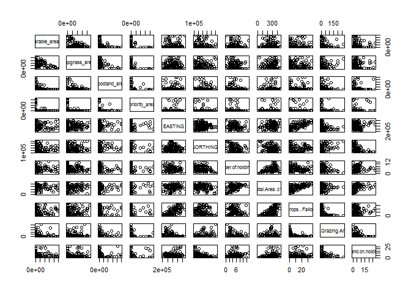

This gives us a lot of relationships to view! Try removing further
columns in the `pairs` command to focus on a few of interest.

We can also use the `cor` function to produce a table of correlations.

    cor(cs_join_agCC[,-c(1,2,3)])

We can think about relationships we might expect to occur between CS and
Agcensus data. For example, we would expect woodland area in CS to be
correlated with woodland area in ag census...

    plot(cs_join_agCC$woodland_area, cs_join_agCC$Woodland.on.holding..c8.)

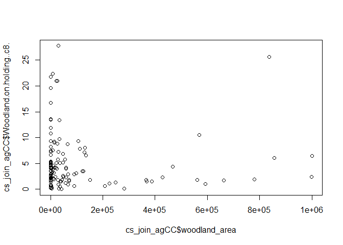

    cor(cs_join_agCC$woodland_area, cs_join_agCC$Woodland.on.holding..c8.)

    ## [1] -0.002118966

In this example there isn't much evidence for a relationship, but that
might not be surprising given the incorrect CS locations!

For most of the relationships between CS and Agcensus it might be
appropriate to investigate correlations as it not clear which variable
would affect which. The exception is relationships with Easting and
Northing, it is clear that Easting can affect arable area but not the
other way round! In this case, a regression model can be built.

Model with arable area measured in CS:

    lm1 <- lm(arable_area ~ EASTING, data = cs_join_agCC)

    summary(lm1)

    ## 
    ## Call:
    ## lm(formula = arable_area ~ EASTING, data = cs_join_agCC)
    ## 
    ## Residuals:
    ##     Min      1Q  Median      3Q     Max 
    ## -180984 -167616 -129334   60759  794105 
    ## 
    ## Coefficients:
    ##               Estimate Std. Error t value Pr(>|t|)  
    ## (Intercept)  1.937e+05  9.463e+04   2.047   0.0428 *
    ## EASTING     -6.076e-02  2.253e-01  -0.270   0.7878  
    ## ---
    ## Signif. codes:  0 '***' 0.001 '**' 0.01 '*' 0.05 '.' 0.1 ' ' 1
    ## 
    ## Residual standard error: 254800 on 122 degrees of freedom
    ## Multiple R-squared:  0.0005961,  Adjusted R-squared:  -0.007596 
    ## F-statistic: 0.07277 on 1 and 122 DF,  p-value: 0.7878

Model with crop area from Agcensus:

    lm2 <- lm(Total.Crops...Fallow..c35. ~ EASTING, data = cs_join_agCC)

    summary(lm2)

    ## 
    ## Call:
    ## lm(formula = Total.Crops...Fallow..c35. ~ EASTING, data = cs_join_agCC)
    ## 
    ## Residuals:
    ##      Min       1Q   Median       3Q      Max 
    ## -16.4687  -5.1376  -0.6752   5.8876  17.7085 
    ## 
    ## Coefficients:
    ##               Estimate Std. Error t value Pr(>|t|)    
    ## (Intercept) -1.502e+01  2.875e+00  -5.223 7.34e-07 ***
    ## EASTING      6.779e-05  6.843e-06   9.905  < 2e-16 ***
    ## ---
    ## Signif. codes:  0 '***' 0.001 '**' 0.01 '*' 0.05 '.' 0.1 ' ' 1
    ## 
    ## Residual standard error: 7.743 on 122 degrees of freedom
    ## Multiple R-squared:  0.4457, Adjusted R-squared:  0.4412 
    ## F-statistic: 98.12 on 1 and 122 DF,  p-value: < 2.2e-16

We can see when using the Agcensus data and Easting that there is more
crop and fallow land in the east of the UK (this should be what we
expected!).

You can consider other relationships that can be investigated with
regression relationships. Extensions to include multiple predictors or
generalised linear models could be developed e.g. a zero inflated
distribution could be used to describe the area of priority habitat.

One aspect that has not been investigated in this short tutorial but
could be a useful exercise to continue improving your skills in
integration would be to look at change over time. We looked at the
earliest Countryside Survey and matched to an appropriate Agricultural
Census but the survey has been repeated three times since then (1990,
1998 and 2007). You could look at:

-   Whether the patterns in data were the same in 2007 as they were in
    1978
-   Whether change in e.g. area of priority habitats is related to
    changes in agricultural practice
-   Whether additional covariates from either Agricultural Census or
    other sources (e.g. climate data) explain changes in habitat areas

Things to consider might be:

-   How to choose appropriate data to match e.g. which Agricultural
    Census years correspond to Countryside Survey years?
-   How to match up locations between years? Do you need a different
    process for Countryside Survey data and Agricultural Census data?
-   How to define an appropriate model to look at change over time

# 9. Interpretation and further reading

When considering how to intepret an integrated analysis we need to think
about the assumptions we made in the analysis. For example, in the
analysis above we assumed:

1.  It was logical and valid to join the two datasets. We justified this
    by using a similar temporal period and spatial scope (late
    1970s, UK/England).

2.  The data meanings have been interpreted and used correctly. This
    requires proper investigation of metadata to understand e.g. units,
    methods of measurement that will influence interpretation of
    the results. Metadata for the datasets used in this analysis is
    available online from
    [agcensus](https://access.edina.ac.uk/agcensus/) and
    [EIDC](https://catalogue.ceh.ac.uk/eidc/documents#term=Countryside+Survey&page=1).
    Note not all metadata is of comparable quality and it is important
    to investigate this before beginning an analysis.

3.  The spatial scales (extent and resolution) are comparable. Here we
    had two problems to contend with: 1) the CS data locations were
    given at a lower resolution to preserve confidentiality, 2) the
    Agcensus data was then averaged to the scale of the low resolution
    CS data. Consider what this means for interpretation - what would
    you write in a paper?

Interpretation is more complex with an integrated analysis so put aside
plenty of time to think about this.

Further reading
---------------

[A framework for data fusion in species distribution modelling (Pacifici
*et al*)](http://onlinelibrary.wiley.com/doi/10.1002/ecy.1710/full)

[Combining and aggregating environmental data (Maas-Hebner *et
al*)](https://www.ncbi.nlm.nih.gov/pubmed/25893765)

[Ecological data sharing (Michener *et
al*)](http://www.sciencedirect.com/science/article/pii/S1574954115001004)

[BES guide to Data Management in Ecology and
Evolution](http://www.britishecologicalsociety.org/wp-content/uploads/Publ_Data-Management-Booklet.pdf)

Contact us
----------

This tutorial was put together for a Data Integration course due to run
on 4th May 2017 which was unfortunately cancelled. Therefore we have not
tested this course in a real life environment so there may be bugs and
errors. Please let us know if you find any by contacting us at
<susjar@ceh.ac.uk> or requesting access to the repository on Github. We
are happy for you to re-use any part of this tutorial in any in-person
or online course.

This course was developed by the British Ecological Society Quantitative
Ecology and Agricultural Ecology Special Interest Groups. You can
contact the SIGs by email (<quantitative@britishecologicalsociety.org>
and <agricultural@britishecologicalsociety.org>) or on Twitter
(@BES\_QE\_SIG and @bes\_aeg).

Happy Data Integration!!
========================
